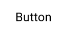
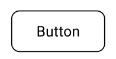
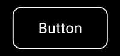
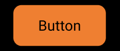
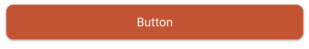

---

**Page Summary**

* [Specifications references](#specifications-references)
* [Accessibility](#accessibility)
* [Variants](#variants)
    * [Text button](#text-button)
    * [Outlined button](#outlined-button)
    * [Contained button](#contained-button)
* [Component specific tokens](#component-specific-tokens)

---

## Specifications references

- [Design System Manager - Buttons](https://system.design.orange.com/0c1af118d/p/120472-buttons/b/223c31)
- [Material Design - Buttons](https://m3.material.io/components/buttons/overview)
- Technical documentation soon available

## Accessibility

Please follow [accessibility criteria for development](https://m3.material.io/components/buttons/accessibility)

Buttons support content labeling for accessibility and are readable by most screen readers, such as
TalkBack. Text rendered in buttons is automatically provided to accessibility services. Additional
content labels are usually unnecessary.

## Variants

### Text button

Text buttons are typically used for less-pronounced actions, including those located in dialogs and
cards. In cards, text buttons help maintain an emphasis on card content.

 

> **Flutter implementation**

Use the `OdsTextButton`:

```dart
return OdsTextButton(
  text: "Text button",
  onClick: () {},
  icon: SvgPicture.asset("assets/ic_profile.svg", // Optional, line can be removed if you don't need any icon
);
```

To display a primary button, you need to pass an `OdsTextButtonStyle`
through the `style` parameter:

```dart
return OdsTextButton(
  text: "Text button",
  onClick: () {},
  icon: SvgPicture.asset("assets/ic_profile.svg"), // Optional, line can be removed if you don't need any icon
  style: OdsTextButtonStyle.functionalPrimary
);
```

### Outlined button

Outlined buttons are medium-emphasis buttons. They contain actions that are important, but aren’t
the primary action in an app.

 

> **Flutter implementation**

Use the `OdsOutlinedButton` composable:

```dart
return OdsOutlinedButton(
  text: "Outlined button",
  onClick: () {},
  icon: SvgPicture.asset('assets/ic_profile.svg'), // Optional, line can be removed if you don't need any icon
);
```

### Contained button

Contained buttons are high-emphasis, distinguished by their use of elevation and fill. They contain
actions that are primary to your app.

 

Functional positive:

 

Functional negative:

 

> **Flutter implementation**

Use the `OdsButton`:

```dart
return OdsButton(
  text: "Contained button",
  onClick: () {},
  icon: SvgPicture.asset("assets/ic_profile.svg"), // Optional, line can be removed if you don't need any icon
);
```

To display a primary button or a functional green/red button, you need to pass an `OdsButtonStyle`
through the `style` parameter:

```dart
return OdsButton(
  text: "Positive button",
  onClick: () {},
  icon: SvgPicture.asset("assets/ic_profile.svg"), // Optional, line can be removed if you don't need any icon
  style: OdsButtonStyle.functionalPositive
);
```

## Component specific tokens

_Soon available_
