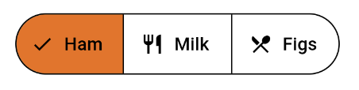
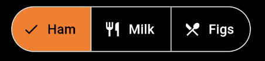
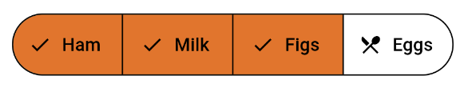
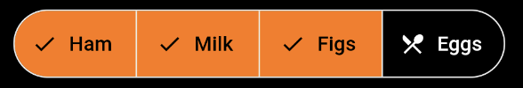

---

**Page Summary**

* [Specifications references](#specifications-references)
* [Accessibility](#accessibility)
* [Variants](#variants)
    * [Text button](#text-button)
        * [Flutter implementation](#flutter-implementation)
    * [Outlined button](#outlined-button)
        * [Flutter implementation](#flutter-implementation-1)
    * [Contained button](#contained-button)
        * [Flutter implementation](#flutter-implementation-2)
    * [Segmented button](#segmented-button)
        * [Flutter implementation](#flutter-implementation-3)
            * [OdsSegmentedButton API](#odssegmentedbutton-api)

---

## Specifications references

- [Design System Manager - Buttons](https://system.design.orange.com/0c1af118d/p/120472-buttons/b/223c31)
- [Material Design - Buttons](https://m3.material.io/components/buttons/overview)
- Technical documentation soon available

## Accessibility

Please follow [accessibility criteria for development](https://m3.material.io/components/buttons/accessibility)

Buttons support content labeling for accessibility and are readable by most screen readers, such as
TalkBack. Text rendered in buttons is automatically provided to accessibility services. Additional
content labels are usually unnecessary.

## Variants

### Text button

Text buttons are typically used for less-pronounced actions, including those located in dialogs and
cards. In cards, text buttons help maintain an emphasis on card content.

 

#### Flutter implementation

Use the `OdsTextButton`:

```dart
return OdsTextButton(
  text: "Text button",
  onClick: () {},
  icon: SvgPicture.asset("assets/ic_profile.svg", // Optional, line can be removed if you don't need any icon
);
```

To display a primary button, you need to pass an `OdsTextButtonStyle`
through the `style` parameter:

```dart
return OdsTextButton(
  text: "Text button",
  onClick: () {},
  icon: SvgPicture.asset("assets/ic_profile.svg"), // Optional, line can be removed if you don't need any icon
  style: OdsTextButtonStyle.functionalPrimary
);
```

### Outlined button

Outlined buttons are medium-emphasis buttons. They contain actions that are important, but aren’t
the primary action in an app.

 

#### Flutter implementation

Use the `OdsOutlinedButton` composable:

```dart
return OdsOutlinedButton(
  text: "Outlined button",
  onClick: () {},
  icon: SvgPicture.asset('assets/ic_profile.svg'), // Optional, line can be removed if you don't need any icon
);
```

### Contained button

Contained buttons are high-emphasis, distinguished by their use of elevation and fill. They contain
actions that are primary to your app.

 

Functional positive:

 

Functional negative:

 

#### Flutter implementation

Use the `OdsButton`:

```dart
return OdsButton(
  text: "Contained button",
  onClick: () {},
  icon: SvgPicture.asset("assets/ic_profile.svg"), // Optional, line can be removed if you don't need any icon
);
```

To display a primary button or a functional green/red button, you need to pass an `OdsButtonStyle`
through the `style` parameter:

```dart
return OdsButton(
  text: "Positive button",
  onClick: () {},
  icon: SvgPicture.asset("assets/ic_profile.svg"), // Optional, line can be removed if you don't need any icon
  style: OdsButtonStyle.functionalPositive
);
```

### Segmented button

A group of toggle buttons. Only one option in a group of toggle buttons can be selected and active
at a time.
Selecting one option deselects any other.
Use for simple choices between two to five items (for more items or complex choices, use chips)

 

#### Flutter implementation

Single-select segmented button :

```dart
enum Foods { ham, milk, figs, eggs, oil }

///Single Choice
Foods foodsView = Foods.ham;
  
return OdsSegmentedButton<Foods>(
        enabled: false, //Optional by default true
        segments: <ButtonSegment<Foods>>[
          ButtonSegment<Foods>(
            value: Foods.ham,
            label: Text("Ham"),
            icon: Icon(Icons.restaurant), // Optional, line can be removed if you don't need any icon
          ),
          ButtonSegment<Foods>(
            value: Foods.milk,
            label: Text("Milk"),
            icon: Icon(Icons.restaurant), // Optional, line can be removed if you don't need any icon
          ),
        ],
        selected: <Foods>{foodsView},
        onSelectionChanged: (Set<Foods> newSelection) {
          setState(
            () {
              foodsView = newSelection.last;
            },
          );
        });
```

Multi-select segmented button :

 

```dart
enum Foods { ham, milk, figs, eggs, oil }

///Multi Choice
Set<Foods> selectionMulti = <Foods>{Foods.ham, Foods.milk};
  
return OdsSegmentedButton<Foods>(
  enabled: false, //Optional by default true
  segments: <ButtonSegment<Foods>>[
    ButtonSegment<Foods>(
      value: Foods.ham,
      label: Text("Ham"),
      icon: Icon(Icons.restaurant), // Optional, line can be removed if you don't need any icon
    ),
    ButtonSegment<Foods>(
      value: Foods.milk,
      label: Text("Milk"),
      icon: Icon(Icons.restaurant), // Optional, line can be removed if you don't need any icon
    ),
  ],
  selected: selectionMulti,
  onSelectionChanged: (Set<Foods> newSelection) {
    setState(() {
      selectionMulti = newSelection;
    });
  },
);


```

##### OdsSegmentedButton API

Parameter | Default&nbsp;value | Description
-- | -- | --
`segments: List<ButtonSegment<T>> segment` | | Descriptions of the segments in the button.
`selected: Set<T>` | | The set of `ButtonSegment.values` that indicate which `segments` are selected.
`onSelectionChanged: (Set<T>)? onSelectionChanged` | `null` | Callback invoked on selection change
`enabled: bool?` | `true` | Controls the enabled state of the segmented button. When false, this segmented button will not be clickable.
{:.table}
