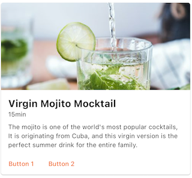
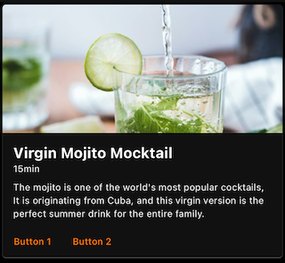
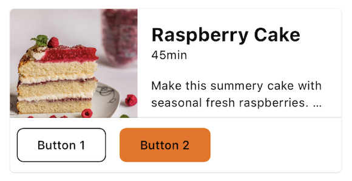
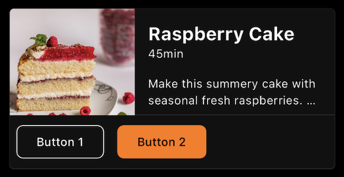

---

**Page Summary**

* Table of contents
{:toc}

---

## Specifications references

- [Design System Manager - Cards](https://system.design.orange.com/0c1af118d/p/0336aa-cards/b/47a25a)
- [Material Design - Cards](https://material.io/components/cards/)
- Technical documentation soon available

## Accessibility

Please follow [accessibility criteria for development](https://m3.material.io/components/cards/accessibility)

## Variants

### Vertical image first card

This is a full width card containing elements arranged vertically with an image as first element.

   

> **Flutter implementation**

In your screen you can use `OdsVerticalImageFirstCard` composable:

```dart
return OdsVerticalImageFirstCard(
  title: "Title",
  image: OdsCardImage(
    imageProvider: NetworkImage(recipe.url),
    contentDescription: 'Picture content description', //Optional
    alignment: Alignment.center, //Optional. Center by default.
    contentScale: BoxFit.cover, //Optional. BoxFit.cover by default.
  ),
  subtitle: "Subtitle", //Optional
  text: "Text", //Optional
  firstButton: OdsOutlinedButton(text: "First button", onClick: () {}), //Optional
  secondButton: OdsButton(text: "Second button", onClick: () {}), //Optional
  onClick: () {},
);
```

##### OdsVerticalImageFirstCard API

Parameter | Default&nbsp;value | Description
-- | -- | --
`title: String` | | Title displayed into the card
`image: OdsCardImage` | | Image displayed into the card
`subtitle: String?` | `null` | Subtitle displayed into the card
`text: String?` | `null` | Text displayed into the card
`firstButton: OdsCard.Button?` | `null` | First button displayed into the card
`secondButton: OdsCard.Button?` | `null` | Second button displayed into the card
`onClick: (() -> Void)?` | `null` | Callback called on card click

### Vertical header first card

This is a full width card containing elements arranged vertically with a header (thumbnail, title & subtitle) as first element.

> **Flutter implementation**

_Soon available_

### Small card

This is a small card which takes the half screen width.

> **Flutter implementation**

You can add an `OdsSmallCard` in your screen to add a small card:

_Soon available_

### Horizontal card

This is a full screen width card with an image on the side. The image can be displayed on the left or on the right.

   

> **Flutter implementation**

In your screen you can use `OdsHorizontalCard` composable:

```dart
return OdsHorizontalCard(
  title: "Title",
  image: OdsCardImage(
    imageProvider: NetworkImage(recipe.url),
    contentDescription: 'Picture content description', //Optional
    alignment: Alignment.center, //Optional. Center by default.
    contentScale: BoxFit.cover, //Optional. BoxFit.cover by default.
  ),
  subtitle: "Subtitle", //Optional
  text: "Text", //Optional
  firstButton: OdsOutlinedButton(text: "First button", onClick: () {}), //Optional
  secondButton: OdsButton(text: "Second button", onClick: () {}), //Optional
  imagePosition: OdsHorizontalCardImagePosition.start, //Optional. Start by default.
  divider: false, // Optional. True by default.
  onClick: () {},
);
```

##### OdsHorizontalCard API

Parameter | Default&nbsp;value | Description
-- | -- | --
`title: String` | | Title displayed into the card
`image: OdsCardImage` | | Image displayed into the card
`subtitle: String?` | `null` | Subtitle displayed into the card
`text: String?` | `null` | Text displayed into the card
`firstButton: OdsCard.Button?` | `null` | First button displayed into the card
`secondButton: OdsCard.Button?` | `null` | Second button displayed into the card
`imagePosition: OdsHorizontalCardImagePosition` | `OdsHorizontalCardImagePosition.Start` | Position of the image within the card, it can be set to `OdsHorizontalCardImagePosition.start` or `OdsHorizontalCardImagePosition.end`
`divider: Boolean` | `false` | Controls the divider display. If true, it will be displayed between the card content and the action buttons.
`onClick: (() -> Void)?` | `null` | Callback called on card click

## Component specific tokens

_Soon available_
