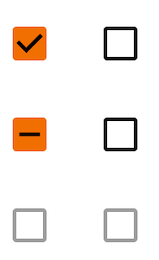
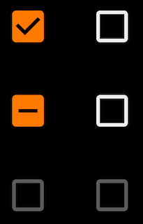

Use checkboxes to:
* Turn an item on or off in a desktop environment

---

**Page Summary**

* [Specifications references](#specifications-references)
* [Accessibility](#accessibility)
* [Implementation](#implementation)
    * [OdsCheckbox API](#odscheckbox-api)

---

## Specifications references

- [Design System Manager - Checkboxes](https://system.design.orange.com/0c1af118d/p/775cb3-checkboxes/b/077247)
- [Material Design - Checkboxes](https://m3.material.io/components/checkbox/overview)
- Technical documentation soon available

## Accessibility

Please follow [accessibility criteria for development](https://m3.material.io/components/checkbox/accessibility)

Checkboxes support content labeling for accessibility and are readable by most screen readers, such
as TalkBack and Voice Over. Text rendered in check boxes is automatically provided to accessibility services.
Additional content labels are usually unnecessary.

### Implementation

 

> **Flutter implementation**

In your screen you can use Checkbox :

```dart
return OdsCheckbox(
  checked: true,
  onCheckedChange: () {},
  enabled: true,
  indeterminate: true, // Optional. False by default
)
```

#### OdsCheckbox API

Parameter | Default&nbsp;value | Description
-- | -- | --
`checked: bool` | | Controls checked state of the checkbox
`onCheckedChange: (bool?)? Callback ` | `null` | Callback invoked on checkbox click. If `null`, then this is passive and relies entirely on a higher-level component to control the checked state.
`enabled: bool` | `true` | Controls enabled state of the checkbox. When `false`, this checkbox will not be clickable.
`indeterminate: bool` | `false` | Controls enabled state of the checkbox
{:.table}
