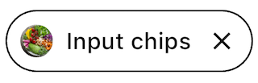
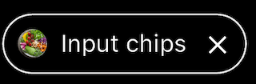
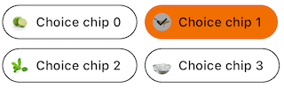
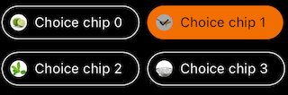
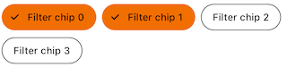
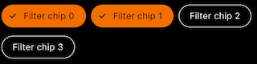
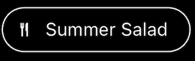

<br>**On this page**

* [Specifications references](#specifications-references)
* [Accessibility](#accessibility)
* [Variants](#variants)
    * [Input chip](#input-chip)
        * [Flutter implementation](#flutter-implementation)
            * [OdsInputChip API](#odsinputchip-api)
    * [Choice chip](#choice-chip)
        * [Flutter implementation](#flutter-implementation-1)
            * [OdsChoiceChip API](#odschoicechip-api)
    * [Filter chip](#filter-chip)
        * [Flutter implementation](#jflutter-implementation-2)
            * [OdsFilterChip API](#odsfilterchip-api)
    * [Action chip](#action-chip)
        * [Flutter implementation](#flutter-implementation-3)
            * [OdsActionChip API](#odsactionchip-api)

---

## Specifications references

- [Design System Manager](https://system.design.orange.com/0c1af118d/p/51ba7c-chips/b/392391)
- [Material Design](https://m3.material.io/components/chips/overview)

## Accessibility

Please follow [accessibility criteria for development](https://m3.material.io/components/chips/accessibility).

Chips support content labeling for accessibility and are readable by most screen readers, such as
screen reader. Text rendered in chips is automatically provided to accessibility services. Additional
content labels are usually unnecessary.

## Variants

### Input chip

Input chips represent a complex piece of information in
compact form, such as an entity (person, place, or thing) or text. They enable user input and verify
that input by converting text into chips.

 

#### Flutter implementation

Use the `OdsChip` composable.
Note that the chip style is outlined or filled according to your OdsTheme component configuration,
outlined by default.

```dart
OdsInputChip(
    text = "Input chip",
    onClick = { },
    leadingIcon = null,
    leadingAvatar: CircleAvatar(
        backgroundImage: NetworkImage(
                OdsApplication.recipes[index].url,
            ),
        ),
    ), // Set it to `null` for no avatar or provide a `leadingIcon`
    enabled = true,
    onCancel = { }
)
```

##### OdsInputChip API

Parameter | Default&nbsp;value | Description
-- | -- | --
`text: String` | | Text to be displayed into the chip
`onClick: (bool?)? Callback` | | Callback called on chip click
`enabled: Boolean` | `true` | Controls the enabled state of the chip. When `false`, this chip will not respond to user input.
`leadingIcon: OdsChipLeadingIcon?` | `null` | Icon to be displayed at the start of the chip, preceding the text
`leadingAvatar: OdsChipLeadingAvatar?` | `null` | Avatar to be displayed in a circle shape at the start of the chip, preceding the content text
`onCancel: (() -> Unit)?` | `null` | Callback called on chip cancel cross click. Pass `null` for no cancel cross.
{:.table}

### Choice chip

Choice chips allow selection of a single chip from a set of options.

Choice chips clearly delineate and display options in a compact area. They are a good alternative to
toggle buttons, radio buttons, and single select menus.


 

#### Flutter implementation

Use the `OdsChoiceChip` composable.
Note that the chip style is outlined or filled according to your OdsTheme component configuration,
outlined by default.

```dart
return OdsChoiceChip(
    text = "Choice text",
    onClick = { },
    leadingAvatar = OdsChipLeadingAvatar(
        image: NetworkImage("https://..."),
        contentDescription: "" // Optional
    ), // Set it to `null` for no avatar
    selected = false,
    enabled = true,
)
```

##### OdsChoiceChip API

Parameter | Default&nbsp;value | Description
-- | -- | --
`text: String` | | Text to be displayed into the chip
`onClick: (bool?)? Callback` | | Callback called on chip click
`enabled: bool?` | `true` | Controls the enabled state of the chip. When `false`, this chip will not respond to user input. It also appears visually disabled and is disabled to accessibility services.
`selected: bool?` | `false` | Controls the selected state of the chip. When `true`, the chip is highlighted.
`leadingAvatar: OdsChipLeadingAvatar?` | `null` | Avatar to be displayed in a circle shape at the start of the chip, preceding the content text
{:.table}


### Filter chip

Filter chips use tags or descriptive words to filter content.

Filter chips clearly delineate and display options in a compact area. They are a good alternative to
toggle buttons or checkboxes.

 

#### Flutter implementation

Use the `OdsFilterChip` composable.
Note that the chip style is outlined or filled according to your OdsTheme component configuration,
outlined by default.

```dart
return OdsFilterChip(
    text = "chip text",
    onClick = { },
    leadingAvatar = OdsChipLeadingAvatar(
        image: NetworkImage("https://..."),
        contentDescription: "" // Optional
    ), // Set it to `null` for no avatar
    selected = false,
    enabled = true,
)
```

##### OdsFilterChip API

Parameter | Default&nbsp;value | Description
-- | -- | --
`text: String` | | Text to be displayed into the chip
`onClick: (bool?)? Callback` | | Callback called on chip click
`enabled: bool?` | `true` | Controls the enabled state of the chip. When `false`, this chip will not respond to user input. It also appears visually disabled and is disabled to accessibility services.
`selected: bool?` | `false` | Controls the selected state of the chip. When `true`, the chip is highlighted.
`leadingAvatar: OdsChipLeadingAvatar?` | `null` | Avatar to be displayed in a circle shape at the start of the chip, preceding the content text
{:.table}

Use the filter like exemple [FilterChip class](https://api.flutter.dev/flutter/material/FilterChip-class.html)

### Action chip

Action chips offer actions related to primary content. They should appear dynamically and
contextually in a UI.

An alternative to action chips are buttons, which should appear persistently and consistently.

 

#### Flutter implementation

Use the `OdsActionChip` composable.
Note that the chip style is outlined or filled according to your OdsTheme component configuration,
outlined by default.

```dart
return OdsActionChip(
    text = "Action chip",
    onClick = {},
    leadingIcon = SvgPicture.asset("assets/recipes/ic_cooking_pot.svg",
                colorFilter: ColorFilter.mode(colorScheme.secondary, BlendMode.srcIn)) // set it to `null` for no icon
    enabled = true, // Optional 
)
```

##### OdsActionChip API

Parameter | Default&nbsp;value | Description
-- | -- | --
`text: String` | | Text to be displayed into the chip
`onClick: (bool?)? Callback` | | Callback called on chip click
`enabled: bool?` | `true` | Controls the enabled state of the chip. When `false`, this chip will not respond to user input. It also appears visually disabled and is disabled to accessibility services.
`selected: bool?` | `false` | Controls the selected state of the chip. When `true`, the chip is highlighted.
`leadingAvatar: Widget?` | `null` | Avatar to be displayed in a circle shape at the start of the chip, preceding the content text
{:.table}
