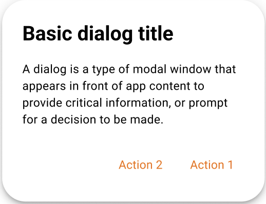
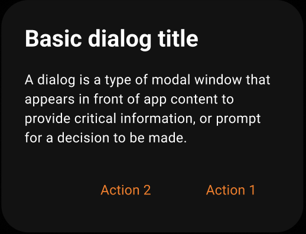

A dialog is a type of modal window that appears in front of app content to
provide critical information or ask for a decision. Dialogs disable all app
functionality when they appear, and remain on screen until confirmed, dismissed,
or a required action has been taken.

Dialogs are purposefully interruptive, so they should be used sparingly.

---

**Page Summary**

* Table of contents
{:toc}

---

## Specifications references

- [Design System Manager - Dialogs](https://system.design.orange.com/0c1af118d/p/78dd2a-dialogs/b/054ce9)
- [Material Design - Dialogs](https://m3.material.io/components/dialogs/overview)
- Technical documentation soon available

## Accessibility

Please follow [accessibility criteria for development](https://m3.material.io/components/dialogs/accessibility)

## Variants

### Alert dialog

Alert dialogs interrupt users with urgent information, details, or actions.

  

> **Flutter implementation**

To display an alert dialog in your screen, you can use:

```dart
return OdsAlertDialog.openDialog(
  context: context,
  title: "title",
  text: "content text of the dialog",
  confirmButton: OdsAlertDialogButton(
    text: "confirm",
    onClick: () => Navigator.of(context).pop(),
  ),
  dismissButton: OdsAlertDialogButton(
    text: "dismiss",
    onClick: () => Navigator.of(context).pop(),
  ),
);
```

## Component specific tokens

_Soon available_
