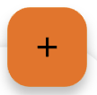
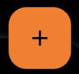
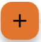
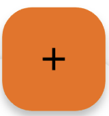
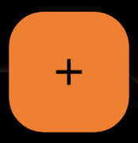
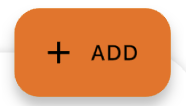
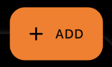

---

**Page Summary**

* Table of contents
{:toc}

---

## Specifications references

- Design System Manager - Floating Action Button (https://system.design.orange.com/0c1af118d/p/564c73-buttons-fab/b/13aba7)
- [Material Design - Buttons: floating action button](https://m3.material.io/components/floating-action-button/overview)
- Technical documentation soon available

## Accessibility

Please follow [accessibility criteria for development](https://m3.material.io/components/floating-action-button/accessibility)

You must define a content description on a FAB via the
`semanticsLabel` attribute so that screen readers are able to announce their goal or action.
By default the screen reader will say "floating action".
This does not concern 'Ods ExtendedFloatingActionButton' as the text will be localized.

## Variants

### Regular FAB

Regular FABs are FABs that are not expanded and are a regular size.

  

> **Flutter implementation**

To display a regular Floating Action Button in your composable screen, use `OdsFloatingActionButton`:

```dart
return OdsFloatingActionButton(
  onClick: () {},
  icon: const Icon(Icons.add),
  semanticsLabel: 'Add', //Optional
);
```

### Small FAB

A small FAB should be used on smaller screens.

Small FABs can also be used to create visual continuity with other screen elements.

  

> **Flutter implementation**

To display a small FAB in your screen use `OdsSmallFloatingActionButton`

```dart
return OdsSmallFloatingActionButton(
  onClick: () {},
  icon: const Icon(Icons.add),
  semanticsLabel: 'Add', //Optional
);
```

### Large FAB

A large FAB should be used on smaller screens.

Small FABs can also be used to create visual continuity with other screen elements.

  

> **Flutter implementation**

To display a small FAB in your screen use `OdsLargeFloatingActionButton`

```dart
return OdsLargeFloatingActionButton(
  onClick: () {},
  icon: const Icon(Icons.add),
  semanticsLabel: 'Add', //Optional
);
```

### Extended FAB

The extended FAB is wider, and it includes a text label.

  


> **Flutter implementation**

To display an extended FAB, use `OdsExtendedFloatingActionButton`:

```dart
return OdsSmallFloatingActionButton(
  onClick: () {},
  text = "Add",
  icon: const Icon(Icons.add), //Optional
);
```


## Component specific tokens

_Soon available_
