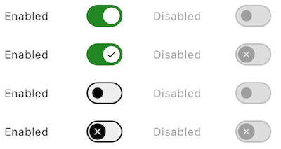
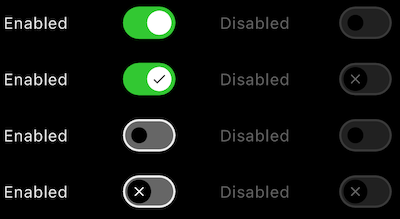
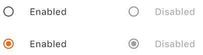
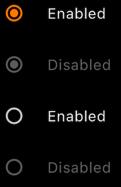

<br>**On this page**

* [Specifications references](#specifications-references)
* [Accessibility](#accessibility)
* [Variants](#variants)
    * [Checkbox list](#checkbox-list)
        * [Flutter implementation](#flutter-implementation)
            * [OdsListItem API](#odslistitem-api)
    * [Switch list](#switch-list)
        * [Flutter implementation](#flutter-implementation-1)
            * [OdsListSwitch API](#odslistswitch-api)
    * [RadioButtons list](#radiobuttons-list)
        * [Flutter implementation](#flutter-implementation-2)
            * [OdsListRadioButton API](#odslistradiobutton-api)

---

## Specifications references

- [Design System Manager - Lists](https://system.design.orange.com/0c1af118d/p/72cb84-lists/b/31df1f)
- [Material Design - Lists](https://material.io/components/lists/)

## Accessibility

_Soon available_

## Variants

### Checkbox list

A ListTile with a Checkbox. In other words, a checkbox with a label.
The entire list tile is interactive: tapping anywhere in the tile toggles the checkbox.

 

#### Flutter implementation

The library offers the `OdsListCheckbox` to display lists items.

In your screen you can use `OdsListCheckbox` :

```dart
return OdsListCheckbox(
  title: "Enabled"
  checked: true,
  onCheckedChange: (Options? value) {},
  enabled: true, // Optional. True by default
  indeterminate: true, // Optional. False by default
)
```

##### OdsListCheckbox API

Parameter | Default&nbsp;value | Description
-- | -- | --
`title: String` | | The text of the list item
`checked: bool` | | Controls checked state of the checkbox
`onCheckedChange: (bool?)? Callback ` | `null` | Callback invoked on checkbox click. If `null`, then this is passive and relies entirely on a higher-level component to control the checked state.
`enabled: bool?` | `true` | Controls enabled state of the checkbox. When `false`, this checkbox will not be clickable.
`indeterminate: bool?` | `false` | Controls enabled state of the checkbox
{:.table}

### Switch list

A ListTile with a Switch. In other words, a switch button with a label.
The entire list tile is interactive: tapping anywhere in the tile toggles the switch button.

 

### Flutter implementation

In your screen you can use:

```dart
return OdsListSwitch(
  title: "Enabled",
  checked: true,
  onCheckedChange = { },
  icon: true, // Optional. False by default
  enabled: true, // Optional. True by default
)
```

#### OdsListSwitch API

Parameter | Default&nbsp;value | Description
-- | -- | --
`title: String` | | The text of the list item
`checked: bool` | | Controls checked state of the switch
`onCheckedChange: (bool?)? Callback ` | `null` | Callback invoked on switch click. If `null`, then this is passive and relies entirely on a higher-level component to control the checked state.
`icon: bool?` | `false` | Icon displayed in the switch button
`enabled: bool?` | `true` | Controls enabled state of the checkbox. When `false`, this switch will not be clickable.
{:.table}

### RadioButtons list

A ListTile with a Radio Button. In other words, a radio button with a label.
The entire list tile is interactive: tapping anywhere in the tile toggles the radio button.

 

### Flutter implementation

In your screen you can use:

```dart
enum Options { option1, option2, option3 }
Options? _selectedOption = Options.option1;

return OdsListRadioButton<Options?>(
  text: "Enabled",
  value: Options.option1,
  groupValue: _selectedOption,
  onCheckedChange: (value) {},
)
```

#### OdsListRadioButton API

Parameter | Default&nbsp;value | Description
-- | -- | --
`text: String?` | | The primary content of the list tile
`value: T` | | The value represented by this radio button
`groupValue: T? ` | | The currently selected value for a group of radio buttons.
`onCheckedChange: ((value: T?) -> Callback)?` | `null` | Called when the user selects this radio button. The radio button passes [value] as a parameter to this callback. The radio button does not actually change state until the parent widget rebuilds theradio button with the new [groupValue]. If null, the radio button will be displayed as disabled. The provided callback will not be invoked if this radio button is already selected.
`enabled: bool? ` | `false` | Controls the enabled state of the radio button. When false, this button will not be clickable.
{:.table}
