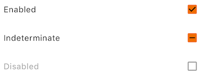
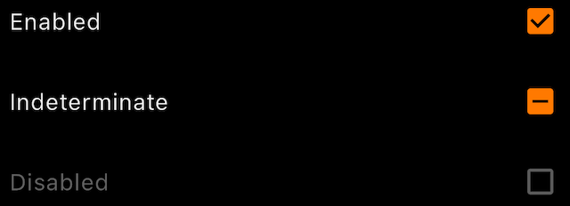

<br>**On this page**

* [Specifications references](#specifications-references)
* [Accessibility](#accessibility)
* [Variants](#variants)
    * [Checkbox list](#checkbox-list)
        * [Flutter implementation](#flutter-implementation)
            * [OdsListItem API](#odslistitem-api)

---

## Specifications references

- [Design System Manager - Lists](https://system.design.orange.com/0c1af118d/p/72cb84-lists/b/31df1f)
- [Material Design - Lists](https://material.io/components/lists/)

## Accessibility

_Soon available_

## Variants

### Checkbox list

A ListTile with a Checkbox. In other words, a checkbox with a label.
The entire list tile is interactive: tapping anywhere in the tile toggles the checkbox.

 

#### Flutter implementation

The library offers the `OdsListCheckbox` to display lists items.

In your screen you can use `OdsListCheckbox` :

```dart
return OdsListCheckbox(
  title: "Enabled"
  checked: true,
  onCheckedChange: () {},
  enabled: true,
  indeterminate: true, // Optional. False by default
)
```

##### OdsListCheckbox API

Parameter | Default&nbsp;value | Description
-- | -- | --
`title: String` | | The text of the list item
`checked: bool` | | Controls checked state of the checkbox
`onCheckedChange: (bool?)? Callback ` | `null` | Callback invoked on checkbox click. If `null`, then this is passive and relies entirely on a higher-level component to control the checked state.
`enabled: bool` | `true` | Controls enabled state of the checkbox. When `false`, this checkbox will not be clickable.
`indeterminate: bool` | `false` | Controls enabled state of the checkbox
{:.table}
