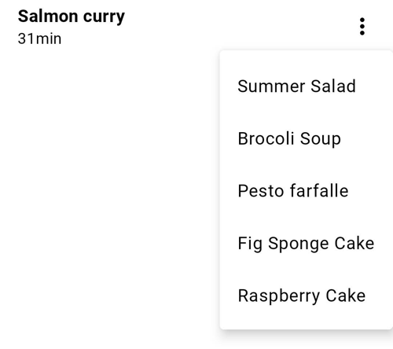
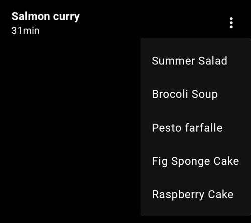
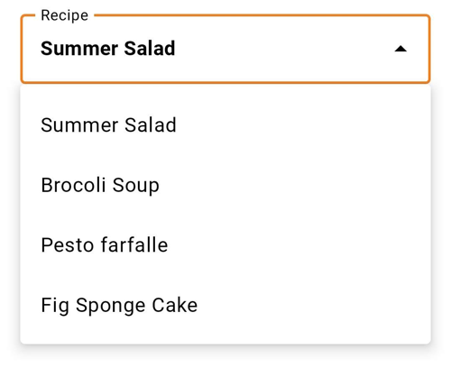
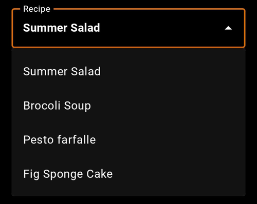

<br>**On this page**

* Table of contents
{:toc}

---

## Specifications references

- [Design System Manager - Menus](https://system.design.orange.com/0c1af118d/p/23bbce-menus/b/215393)
- [Material Design - Menus](https://m3.material.io/components/menus/overview)

## Accessibility

Please follow [accessibility criteria for development](https://m3.material.io/components/menus/accessibility).

The icons which can be displayed in a dropdown menu are always associated to a text so they don't need a content description.

## Variants

### Dropdown menu

A dropdown menu is a compact way of displaying multiple choices. It appears upon interaction with an element (such as an icon or button) or when users perform a specific action.

 

#### Flutter Implementation

The library offers an `OdsDropdownMenu` container composable in which you can add `OdsDropdownMenu.Item` or `OdsDivider` as shown in the following example:

```dart
return OdsDropdownMenu(
  items: [
    OdsDropdownMenuItem(
      text: "Summer Salad",
      value: "Summer Salad",
      enabled: false, //Optional by default true
      icon: const Icon(Icons.coffee) // Optional
    ),
  ],
    selectedItem: (String value) {
    print('$value');
  },
);
```

##### OdsDropdownMenu API

Parameter | Default&nbsp;value | Description
-- | -- | --
`items: List<OdsDropdownMenuItem<String>>` | | Items displayed into the dropdown menu
`selectedItem: Function(T?)?` | | Selected item displayed
{:.table}

##### OdsDropdownMenuItem API

Parameter | Default&nbsp;value | Description
-- | -- | --
`text: String` | | Typically a Text
`value: T?` | | The value that will be returned by showMenu if this entry is selected.
`enabled: bool?` | `true` | Whether the user is permitted to select this item.
`icon: Widget?` | `null` | Typically a single-line ListTile for menus with icons.
{:.table}

### Exposed dropdown menu

Exposed dropdown menus display the currently selected menu item above the menu. This is a combination of a text field and a menu.

  

#### Flutter Implementation

To display an exposed dropdown menu, you can use the `OdsExposedDropdownMenu` composable. As shown below, you should provide a list of `OdsExposedDropdownMenu.Item` corresponding to the items displayed in the menu (with or without icons).

```dart
return OdsExposedDropdownMenu(
  label: "Recipe",
  enabled: false, // Optional by default true
  items: <DropdownMenuEntry<String>>[
    DropdownMenuEntry<String>(
      value: "Summer Salad",,
      label: "Summer Salad",,
      leadingIcon: const Icon(Icons.coffee), // Optional
    ),
  ],
  selectedItem: (value) {
    setState(() {
      print('$value');
    });
  },
);


```

##### OdsExposedDropdownMenu API

Parameter | Default&nbsp;value | Description
-- | -- | --
`label: String` | | Label of the exposed menu text field
`items: List<DropdownMenuEntry>` | | Items displayed into the dropdown menu
`selectedItem: Function(T?)?` | | Selected item displayed into the text field
`enabled: Boolean` | `true` | Controls the enabled state of the dropdown menu. When `false`, the dropdown menu text field will be neither clickable nor focusable, visually it will appear in the disabled state.
