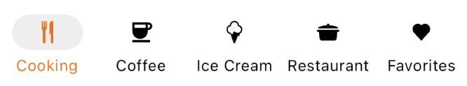
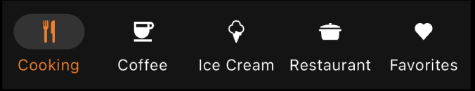

---

**Page Summary**

* [Specifications references](#specifications-references)
* [Accessibility](#accessibility)
* [Implementation](#implementation)
* [Component specific tokens](#component-specific-tokens)

---

## Specifications references

- [Design System Manager - Navigation bars](https://system.design.orange.com/0c1af118d/p/71767c-navigation-bars/b/73e579)
- [Material Design - Navigation bars](https://m3.material.io/components/navigation-bar/overview)
- Technical documentation soon available

## Accessibility

Please follow [accessibility criteria for development](https://m3.material.io/components/navigation-bar/accessibility)


## Implementation

  

  

> **Flutter implementation**

In your screen, use the `OdsNavigationBar`. It should contain multiple `OdsNavigationItems`.

Here is an example:

```dart
late int selectedIndex = 0;

return OdsNavigationBar(
  selectedIndex: selectedIndex,
  onDestinationSelected: (index) {
    setState(() {
      selectedIndex = index;
    });
  },
  destinations: _destinations,
)
```

> **OdsNavigationItem implementation**

You can add a native Flutter icons, an svg or png image  : select icon type (svg or png or icon)

Source code:

```dart
List<OdsNavigationItem> _destinations(BuildContext context) {
  return [
    OdsNavigationItem(
      context: context,
      label: "Cooking",
      odsBottomNavigationItemIcon: OdsBottomNavigationItemIcon(
        icon: "assets/recipes/ic_cooking_pot.svg",
        type: IconType.svg,
        badge: "3", // Optional, line can be removed if you don't need any badge
      ),
    ),
    OdsNavigationItem(
      context: context,
      label: "Cooking",
      odsBottomNavigationItemIcon: OdsBottomNavigationItemIcon(
        icon: "assets/recipes/ic_cooking_pot.svg",
        type: IconType.png,
      ),
    ),
    OdsNavigationItem(
      context: context,
      label: "Coffee",
      odsBottomNavigationItemIcon: OdsBottomNavigationItemIcon(
        icon: Icon(Icons.coffee_sharp),
        type: IconType.icon,
      ),
    ),
    ...
  ];
}
```

## Component specific tokens

_Soon available_
