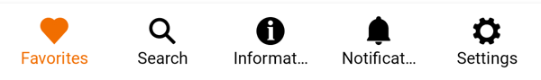
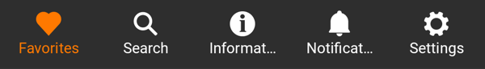

---

**Page Summary**

* [Specifications references](#specifications-references)
* [Accessibility](#accessibility)
* [Implementation](#implementation)
* [Component specific tokens](#component-specific-tokens)

---

## Specifications references

- [Design System Manager - Navigation bars](https://system.design.orange.com/0c1af118d/p/71767c-navigation-bars/b/73e579)
- [Material Design - Navigation bars](https://m3.material.io/components/navigation-bar/overview)
- Technical documentation soon available

## Accessibility

Please follow [accessibility criteria for development](https://m3.material.io/components/navigation-bar/accessibility)


## Implementation

  

  

> **Flutter implementation**

In your screen, use the `OdsNavigationBar`. It should contain multiple `OdsBottomBarItem`s.

Here is an example:

```dart
class NavigationBarDemo extends State<NavigationBarScreen> {
  var _selectedIndex = 0;

  @override
  Widget build(BuildContext context) {
    var navigationItems = NavigationItems(context);
    var selectedItem = navigationItems.getSelectedMenuItem(_selectedIndex);

    return Scaffold(
      bottomNavigationBar: MediaQuery.of(context).size.width < 640
          ? OdsTab(
              selectedIndex: _selectedIndex,
              onDestinationSelected: (int index) {
                setState(() {
                  _selectedIndex = index;
                });
              },
              destinations: navigationItems.getBottomNavigationBarItems(),
            )
          : null,
      body: Row(
        children: [
          if (MediaQuery.of(context).size.width >= 640)
            NavigationRail(
              onDestinationSelected: (int index) {
                setState(() {
                  _selectedIndex = index;
                });
              },
              selectedIndex: _selectedIndex,
              destinations: navigationItems.getNavigationRailDestinations(),
              labelType: NavigationRailLabelType.all,
              // Called when one tab is selected,
            ),
          Expanded(
            child: navigationItems.getScreens(_selectedIndex),
          ),
        ],
      ),
    );
  }
}
```

> **NavigationItems implementation**

Source code:

```dart
class NavigationItems {
  late BuildContext context;
  late List<NavigationDestination> _destinationsStatic;
  late List<NavigationRailDestination> _destinationsRailStatic;
  late List<Widget> _screens;

  NavigationItems(this.context) {
    var colorScheme = Theme.of(context).colorScheme;

    var activeColorFilter =
        ColorFilter.mode(colorScheme.primary, BlendMode.srcIn);
    var colorFilter = ColorFilter.mode(colorScheme.secondary, BlendMode.srcIn);

    _destinationsStatic = [
      NavigationDestination(
        tooltip: '',
        icon: SvgPicture.asset("assets/ic_guidelines_dna.svg",
            colorFilter: colorFilter),
        selectedIcon: SvgPicture.asset("assets/ic_guidelines_dna.svg",
            colorFilter: activeColorFilter),
        label: AppLocalizations.of(context)!.bottomNavigationGuideline,
      ),
    ];
    _destinationsRailStatic = [
      NavigationRailDestination(
        icon: SvgPicture.asset("assets/ic_guidelines_dna.svg",
            colorFilter: colorFilter),
        selectedIcon: SvgPicture.asset("assets/ic_guidelines_dna.svg",
            colorFilter: activeColorFilter),
        label: Text(
          AppLocalizations.of(context)!.bottomNavigationGuideline,
        ),
      ),
    ];
    _screens = [
      GuidelinesScreen(odsGuidelines: guidelines(context)),
    ];
  }

  getSelectedMenuItem(int index) {
    return _destinationsStatic[index];
  }

  getBottomNavigationBarItems() {
    return _destinationsStatic;
  }

  getNavigationRailDestinations() {
    return _destinationsRailStatic;
  }

  getScreens(int index) {
    return _screens[index];
  }
}
```

## Component specific tokens

_Soon available_
