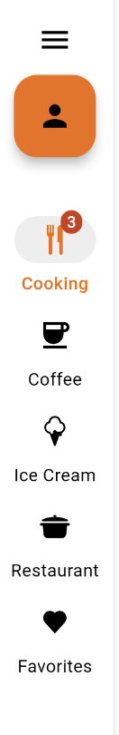
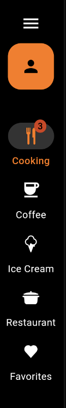

---

**Page Summary**

* [Specifications references](#specifications-references)
* [Accessibility](#accessibility)
* [Implementation](#implementation)
    * [OdsNavigationRail](#odsnavigationrail)
        * [Flutter implementation](#flutter-implementation)
* [OdsNavigationRail API](#odsnavigationrail-api)

---

## Specifications references

- [Design System Manager - Cards] - soon available
- [Material Design - Cards](https://m3.material.io/components/navigation-rail/)

## Accessibility

Please follow [accessibility criteria for development](https://m3.material.io/components/navigation-rail/accessibility)

## Implementation

### OdsNavigationRail

This is a full width card containing elements arranged vertically with an image as first element.

   

> **Flutter implementation**

In your screen you can use `OdsNavigationRail` :

```dart
late int selectedIndex = 0;

return OdsNavigationRail(
  selectedIndex: selectedIndex,
  onDestinationSelected: (index) {
    setState(() {
      selectedIndex = index;
    });
  },
  leadingIconFirst: firstIcon, // Optional null by default
  leadingIconSecond: secondIcon, // Optional null by default
  destinations: _destinations,
)
```

> **OdsNavigationRailItem implementation**

Identify the 3 examples based on your need to use icons

You can add :
- a native Flutter icons
- an svg
- a png image

Source code:

```dart
List<OdsNavigationItem> _destinations(BuildContext context) {
  return [
    OdsNavigationItem(
      context: context,
      label: "Cooking",
      icon: "assets/recipes/ic_cooking_pot.svg", // Extension svg
      badge: "3", // Optional, line can be removed if you don't need any badge
    ),
    OdsNavigationItem(
      context: context,
      label: "Cooking",
      icon: "assets/recipes/ic_cooking_pot.png", // Extension png
    ),
    OdsNavigationItem(
      context: context,
      label: "Coffee",
      icon: Icon(Icons.coffee_sharp), // Widget Icon
    ),
    ...
  ];
}
```

##### OdsNavigationRail API

Parameter | Default&nbsp;value | Description
-- | -- | --
`selectedIndex: int` | | The index into `destinations` for the current selected NavigationRailDestination or null if no destination is selected
`destinations: List<OdsNavigationRailItem>` | | Defines the appearance of the button items that are arrayed within the navigation rail.
`onDestinationSelected: Function(int)?` | | Called when one of the destinations is selected.
`leadingIconFirst: Widget?` | `null` | The first leading widget in the rail that is placed above the destinations.
`leadingIconSecond: Widget?` | `null` | The second leading widget in the rail that is placed above the destinations.
{:.table}
