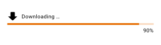
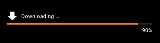
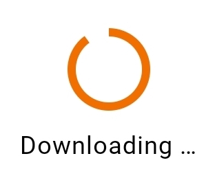
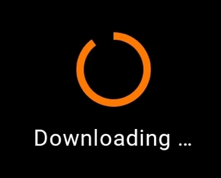

---

**Page Summary**

* Table of contents
{:toc}

---

## Specifications references

- [Design System Manager - Progress indicators](https://system.design.orange.com/0c1af118d/p/085a98-progress-indicators/b/623d1d)
- [Material Design - Progress indicators](https://m3.material.io/components/progress-indicators/accessibility)
- Technical documentation soon available

## Accessibility

Please follow [accessibility criteria for development](https://m3.material.io/components/progress-indicators/accessibility)

## Variants

### Progress bar

Progress bars, also called linear progress indicators, display progress by animating an indicator along the length of a fixed,
visible track. The behavior of the indicator is dependent on whether the progress of a process is
known.

Linear progress indicators support both determinate and indeterminate operations.

* Determinate operations display the indicator increasing in width
  from 0 to 100% of the track, in sync with the process’s progress.
* Indeterminate operations display the indicator continually growing
  and shrinking along the track until the process is complete.

  

  

> **Flutter implementation**

You can use the composable `OdsLinearProgressIndicator` like this:

For a **determinate** linear progress indicator, provide the progress value:

```dart
return OdsLinearProgressIndicator(
  progress: 0.9,
  label: 'Downloading ...', // Optional
  icon: const Icon(Icons.download), // Optional
  showCurrentValue: true,
)
```

For an **indeterminate** linear progress indicator, no need to provide a progress value:

```dart
return OdsLinearProgressIndicator(
            label: 'Downloading ...', // Optional
            icon: const Icon(Icons.download),
);
```


### Activity indicator

Activity indicators, also called circular progress indicators, display progress by animating an indicator along an
invisible circular track in a clockwise direction. They can be applied directly
to a surface, such as a button or card.

Circular progress indicators support both determinate and indeterminate
processes.

* Determinate circular indicators fill the invisible, circular track with
  color, as the indicator moves from 0 to 360 degrees.
* Indeterminate circular indicators grow and shrink in size while moving along
  the invisible track.

  

> **Flutter implementation**

You can use the `OdsCircularProgressIndicator` composable like this:

- For a **determinate** circular progress indicator, provide the progress value:

```dart
return OdsCircularProgressIndicator(
    progress = 0.9,
    label = "Downloading ..." // Optional
)
```

- For an **indeterminate** circular progress indicator, no need to provide a progress value:

```dart
return OdsCircularProgressIndicator(
    label = "Downloading ..." // Optional
)
```

## Component specific tokens

_Soon available_
