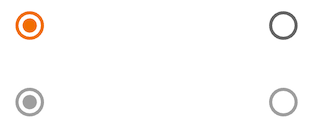

Use radio buttons to:

* Select a single option from a list
* Expose all available options
* If available options can be collapsed, consider using a dropdown menu
  instead, as it uses less space.

<br>**On this page**

* [Specifications references](#specifications-references)
* [Accessibility](#accessibility)
* [Implementation](#implementation)
    * [Flutter code](#flutter-code)
        * [OdsRadioButton API](#odsradiobutton-api)

---

## Specifications references

- [Design System Manager - Selection controls](https://system.design.orange.com/0c1af118d/p/91bf00-radio-buttons/b/347e8d)
- [Material Design - Radio buttons](https://material.io/components/radio-buttons/)

## Accessibility

Please follow [accessibility criteria for development](https://a11y-guidelines.orange.com/en/mobile/android/development/).

Radio buttons support content labeling for accessibility and are readable by
most screen readers, such as TalkBack. Text rendered in radio buttons is
automatically provided to accessibility services. Additional content labels are
usually unnecessary.

## Implementation

 

### Flutter code

In your screen you can use:

```dart
enum Options { option1, option2, option3 }
Options? _selectedOption = Options.option1;

return OdsRadioButton(
  value: Options.option1,
  groupValue: _selectedOption,
  onChanged: (value) {}
)
```

#### OdsRadioButton API

Parameter | Default&nbsp;value | Description
-- | -- | --
`value: T` | | The value represented by this radio button
`groupValue: T? ` | | The currently selected value for a group of radio buttons.
`onCheckedChange: ((value: T?) -> Callback)?` | `null` | Called when the user selects this radio button. The radio button passes [value] as a parameter to this callback. The radio button does not actually change state until the parent widget rebuilds theradio button with the new [groupValue]. If null, the radio button will be displayed as disabled. The provided callback will not be invoked if this radio button is already selected.
`enabled: bool? ` | false | Controls the enabled state of the radio button. When false, this button will not be clickable.
{:.table}
