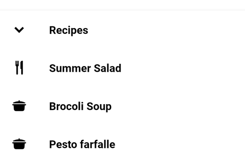
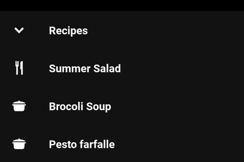

Use Sheets bottom to:

* Expose all complements options

<br>**On this page**

* Table of contents
{:toc}

---

## Specifications references

- [Design System Manager - Sheets](https://system.design.orange.com/0c1af118d/p/474c8d-sheets-bottom/b/16ad0b)
- [Material Design - Sheets: bottom](https://m3.material.io/components/bottom-sheets/overview)

## Accessibility

Please follow [accessibility criteria for development](https://m3.material.io/components/bottom-sheets/accessibility).

## Implementation

 

The contents within a bottom sheet should follow their own accessibility guidelines, such as images having content descriptions set on them.

### Flutter

```dart
return Scaffold(
  bottomSheet: OdsSheetsBottom(
    sheetContent = {
        // Put here the content of the sheet
    },
    title: "Recipes",
  ),
);
```

#### OdsSheetsBottom API [#](#odsheetbottom-api-)

Parameter | Default&nbsp;value | Description
-- | -- | --
`title: String` | | Title header of the bottom sheet
`sheetContent: Widget` |  | Content of the bottom sheet
