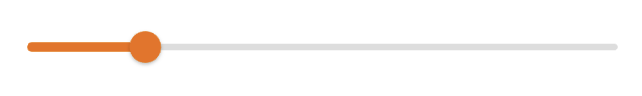
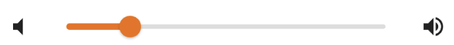
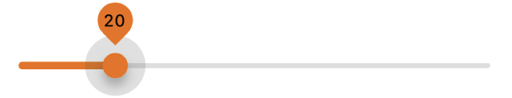
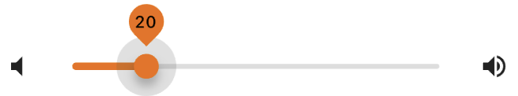
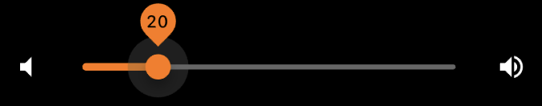
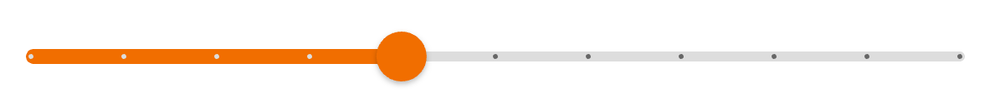
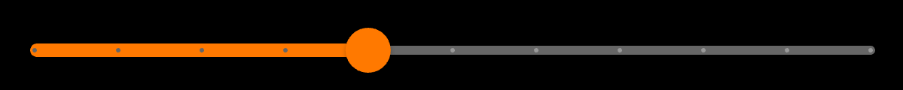

---

**Page Summary**

* [Specifications references](#specifications-references)
* [Accessibility](#accessibility)
* [Variants](#variants)
  * [Continuous slider](#continuous-slider)
  * [Continuous lockups slider](#continuous-lockups-slider)
  * [Discrete slider](#discrete-slider)
  * [Discrete lockups slider](#discrete-lockups-slider)
* [Component specific tokens](#component-specific-tokens)

---

## Specifications references

- [Design System Manager - Sliders](https://system.design.orange.com/0c1af118d/p/66b77a-sliders/b/10df4f)
- [Material Design - Sliders](https://material.io/components/sliders/)
- Technical documentation soon available

## Accessibility

Please follow [accessibility criteria for development](https://m3.material.io/components/sliders/accessibility)

Sliders support setting content descriptors for use with screen readers. 

## Variants

## Continuous slider

Continuous sliders allow users to make meaningful selections that don’t require
a specific value.

 

With icons:

 


In your screen you can use:

```dart
class _BodyState extends State<_Body> {
  double sliderValue = 20.0;

  @override
  Widget build(BuildContext context) {
    return OdsSlider(
      sliderValue: sliderValue,
    );
  }
}
```

You can add icons to the continuous slider like this:

```dart
return OdsSlider(
      sliderValue: 20.0,
      iconLeft: Icon(Icons.volume_mute),
      iconRight: Icon(Icons.volume_up),
);
```

## Continuous lockups slider

 

With icons:

 


In your screen you can use:

```dart
class _BodyState extends State<_Body> {
  double sliderValue = 20.0;

  @override
  Widget build(BuildContext context) {
    return OdsSlider(
      sliderValue: sliderValue,
      label: sliderValue.round().toString(),
    );
  }
}
```

You can add icons to the continuous lockups slider like this:

```dart
return OdsSlider(
      sliderValue: 20.0,
      label: sliderValue.round().toString(),
      iconLeft: Icon(Icons.volume_mute),
      iconRight: Icon(Icons.volume_up),
);
```

### Discrete slider

Discrete sliders display a numeric value label upon pressing the thumb, which
allows a user to input an exact value.

 

With icons:

 

In your screen you can use:

```dart
class _BodyState extends State<_Body> {
  double sliderValue = 20.0;

  @override
  Widget build(BuildContext context) {
    return OdsSlider(
      sliderValue: sliderValue,
      divisions: 10,
    );
  }
}
```

You can add icons to the discrete slider like this:

```dart
return OdsSlider(
      sliderValue: sliderValue,
      divisions: 10,
      iconLeft: Icon(Icons.volume_mute),
      iconRight: Icon(Icons.volume_up),
 );
```

## Component specific tokens

_Soon available_

