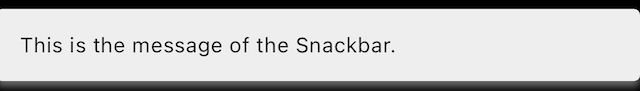
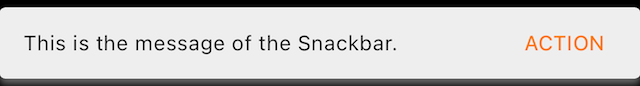
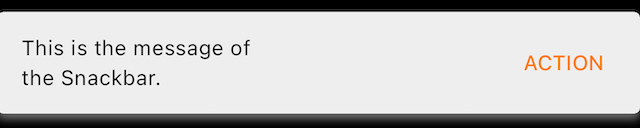
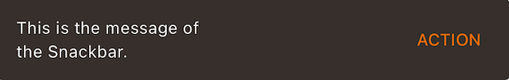
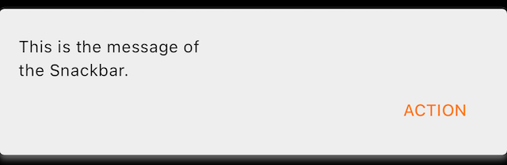

Snackbars inform users of a process that an app has performed or will perform.
They appear temporarily, towards the bottom of the screen. They shouldn’t
interrupt the user experience, and they don’t require user input to disappear.
They disappear either after a timeout or after a user interaction elsewhere on
the screen, but can also be swiped off the screen.

Snackbars can also offer the ability to perform an action, such as undoing an
action that was just taken, or retrying an action that had failed.

<br>**On this page**

* [Specifications references](#specifications-references)
* [Accessibility](#accessibility)
* [Implementation](#implementation)
    * [Flutter code](#flutter-code)
        * [OdsSnackbar API](#odssnackbar-api)

---

## Specifications references

- [Design System Manager - Snackbars](https://system.design.orange.com/0c1af118d/p/259fde-snackbars/b/28c190)
- [Material Design - Snackbars](https://m3.material.io/components/snackbar/overview)

## Accessibility

Please follow [accessibility criteria for development](https://m3.material.io/components/snackbar/accessibility).

Snackbars support content labeling for accessibility and are readable by most
screen readers, such as TalkBack. Text rendered in snackbars is automatically
provided to accessibility services. Additional content labels are usually
unnecessary.

## Implementation

### Variant single lines




With action button:





### Variant two lines






### Variant longer action button





#### Flutter code

We advise you to use a `Scaffold` to add an `OdsSnackbars` in order to make sure everything is displayed together in the right place according to Material Design.

Then use Ods Snackbar with the correct method to display the snackbar with `showSnackbarSingleLine`, `showSnackbarTwoLines` or `showSnackbarLongerAction` :

```dart
return OdsButton(
  text: 'Show snackbar',
  onClick: () {
    OdsSnackbar.showSnackbarSingleLine(
      context: context,
      message: "This is the message of the Snackbar.",
      actionLabel: "ACTION", // Optional
      onPressed: () {}, // Optional
    );
  },
);
```

##### OdsSnackbar API

Parameter | Default&nbsp;value | Description
-- | -- | --
`message: String` | | State of this component to read and show `OdsSnackbar` accordingly.
`context: Context` | `BuildContext` | `Context` applied to the snackbar
`actionLabel: Button` | | The button action label
`onPressed: Button` | | The callback to be called when the button is pressed 
{:.table}
