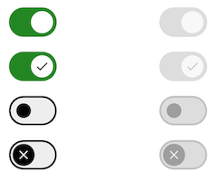
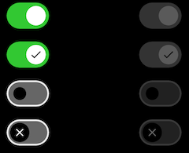

Switches toggle the state of a single setting on or off. They are the preferred
way to adjust settings on mobile.

<br>**On this page**

* [Specifications references](#specifications-references)
* [Accessibility](#accessibility)
* [Implementation](#implementation)
    * [Flutter code](#flutter-code)
        * [OdsSwitch API](#odsswitch-api)

---

## Specifications references

- [Design System Manager - Selection controls](https://system.design.orange.com/0c1af118d/p/58c374-switches/b/516c4e)
- [Material Design - Switch](https://m3.material.io/components/switch/overview)

## Accessibility

Please follow [accessibility criteria for development](https://m3.material.io/components/switch/accessibility).

Switches support content labeling for accessibility and are readable by most
screen readers, such as screen reader. Text rendered in switches is automatically
provided to accessibility services. Additional content labels are usually
unnecessary.

## Implementation

 

### Flutter code

In your screen you can use:

```dart
return OdsSwitch(
    checked = true,
    onCheckedChange = { },
    icon = true // Optional. False by default
    enabled = true // Optional. True by default
)
```

#### OdsSwitch API

Parameter | Default&nbsp;value | Description
-- | -- | --
`checked: bool` | | Controls the checked state of the switch
`onCheckedChange: (bool?)? Callback` | `null` | Callback invoked on switch check. If `null`, then this is passive and relies entirely on a higher-level component to control the "checked" state.
`icon: bool?` | `false` | Icon displayed in the switch button
`enabled: bool?` | `true` | Controls the enabled state of the switch. When `false`, the switch will not be checkable and appears disabled.
{:.table}

