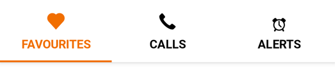
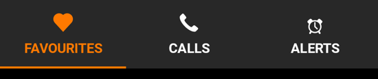

---

**Page Summary**

* Table of contents
{:toc}

---

## Specifications references

- [Design System Manager - Tabs](https://system.design.orange.com/0c1af118d/p/04f537-tabs/b/3536fb)
- [Material Design - Tabs](https://material.io/components/tabs/)
- Technical documentation soon available

## Accessibility

Please follow [accessibility criteria for development](https://material.io/components/tabs/accessibility)


## Variants

### Fixed tabs

Fixed tabs display all tabs on one screen, with each tab at a fixed width. The
width of each tab is determined by dividing the number of tabs by the screen
width. They don’t scroll to reveal more tabs; the visible tab set represents the
only tabs available.

 > **Flutter implementation**

In Compose, the fixed tabs should be added inside of an `OdsTabRow`.
The used composable for tab depends on the type of tabs to display: classic `OdsTab` or `OdsLeadingIconTab`.

  

  

**`OdsTab` composable:**

This composable allows to display:
- an icon only tab
- a text label only tab
- a tab with an icon on top of text label

```dart
class _NavBarDemoState extends State<_NavBarDemo> {
  late int selectedIndex;

  @override
  void initState() {
    super.initState();
    selectedIndex = 1;
  }

  @override
  Widget build(BuildContext context) {
    List<Widget> navigationDestinations = _destinations(context).sublist(0, 3);

    return SafeArea(
      child: SingleChildScrollView(
        padding: EdgeInsets.only(bottom: 100),
        child: Column(
          crossAxisAlignment: CrossAxisAlignment.center,
          children: [
            /// Screens for each navigation destination
            SizedBox(
              height: 110,
              child: IndexedStack(
                index: selectedIndex,
                children: [
                  Center(child: Text('Favourites')),
                  Center(child: Text('Calls')),
                  Center(child: Text('Alerts')),
                ],
              ),
            ),

            /// Navigation Bar icon
            Padding(
              padding: EdgeInsets.all(spacingM),
              child: Align(
                alignment: Alignment.center,
                child: OdsNavigationBar(
                  selectedIndex: selectedIndex,
                  onDestinationSelected: (index) {
                    setState(() {
                      selectedIndex = index;
                    });
                  },
                  destinations: navigationDestinations,
                ),
              ),
            ),
          ],
        ),
      ),
    );
  }
}
```

**`OdsLeadingIconTab` composable:**


If icons are provided in SVG format the system does not apply right color on images if selected. So we need to provide icon: and selectedIcon: parameters with right colorFilter using theme like this :

```dart
  List<NavigationDestination> _destinations(BuildContext context) {
    var colorScheme = Theme.of(context).colorScheme;

    var activeColorFilter =
        ColorFilter.mode(colorScheme.primary, BlendMode.srcIn);
    var colorFilter = ColorFilter.mode(colorScheme.secondary, BlendMode.srcIn);
    return [
      NavigationDestination(
          tooltip: '',
          icon: SvgPicture.asset("assets/recipes/ic_favourites.svg",
              colorFilter: colorFilter),
          selectedIcon: SvgPicture.asset("assets/recipes/ic_favourites.svg",
              colorFilter: activeColorFilter),
          label: "Favourites"),
      NavigationDestination(
          tooltip: '',
          icon: SvgPicture.asset("assets/recipes/ic_calls.svg",
              colorFilter: colorFilter),
          selectedIcon: SvgPicture.asset("assets/recipes/ic_calls.svg",
              colorFilter: activeColorFilter),
          label: "Calls"),
      NavigationDestination(
          tooltip: '',
          icon: SvgPicture.asset("assets/recipes/ic_alertes.svg",
              colorFilter: colorFilter),
          selectedIcon: SvgPicture.asset("assets/recipes/ic_alertes.svg",
              colorFilter: activeColorFilter),
          label: "Alertes"),
    ];
  }
```


## Component specific tokens

_Soon available_
