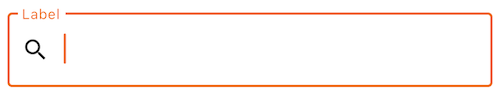
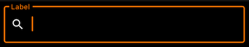
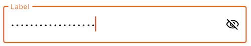
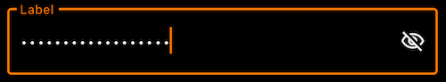

<br>**On this page**

* Table of contents
{:toc}

---

## Specifications references

- [Design System Manager - Text fields](https://system.design.orange.com/0c1af118d/p/86dc02-text-fields/b/97c28f)
- [Material Design - Text fields](https://material.io/components/text-fields/)

## Accessibility

Please follow [accessibility criteria for development](https://m3.material.io/components/text-fields/accessibility).

Android's text field component APIs support both label text and helper text for informing the user
as to what information is requested for a text field.

## Variants

### Text field [#](#text-field-)

A text field can be filled or outlined.  
The outlined version is more accessible in term of contrast. This is the reason why Orange text fields are outlined.

  



#### Flutter implementation

To add a text field in your composable screen you can use the `OdsTextField` composable as follow:

```dart
final TextEditingController controllerTextField = TextEditingController();

return OdsTextField(
      controller: controllerTextField,
      enabled: true, //Optional by default false
      errorMessage: "Error message",
      keyboardType: TextInputType.text,
      keyboardActions: TextInputAction.done,
      label: "Label",
      trailingIcon: IconButton(
        icon: const Icon(Icons.clear),
        onPressed: () => controllerTextField.clear(),
      ),
      trailingText: "Units",
      leadingIcon: const Icon(Icons.search),
      characterCounter: 20,
      maxLines: 5,
      textCapitalization: true, //Optional by default false
);

```

The library provides several `keyboardActions: TextInputAction` that you can use an action the user has requested the text input control to perform
Please follow [TextInputAction](https://api.flutter.dev/flutter/services/TextInputAction.html).

The library provides several `keyboardType: TextInputType` that you can use type of information for which to optimize the text input control
Please follow [TextInputType](https://api.flutter.dev/flutter/services/TextInputType-class.html).

##### OdsTextField API [#](#odstextfield-api-)

Parameter | Default&nbsp;value | Description
-- | -- | --
<b>`onValueChange: (String)? -> Void`</b> | | Callback that is triggered when the input service updates the text. An updated text comes as a parameter of the callback.
`trailingIcon: Widget?` | `null` | Trailing icon to display at the end of the text field
`trailingText: Widget?` | `null` | Trailing text to display at the end of the text field
`enabled: Boolean` | `true` | Controls the enabled state of the text field. When `false`, the text field will be neither editable nor focusable, the input of the text field will not be selectable, visually text field will appear in the disabled UI state.
`readOnly: Boolean` | `false` | Controls the editable state of the text field. When `true`, the text field can not be modified, however, a user can focus it and copy text from it. Read-only text fields are usually used to display pre-filled forms that user can not edit.
`label: String?` | `null` | Label to be displayed inside or outside the text field.
`placeholder: String?` | `null` | Placeholder to be displayed when the text field is in focus and the input text is empty.
`leadingIcon: Widget?` | `null` | Icon displayed at the beginning of the text field container
`errorMessage: String?` | `null` | Message displayed below the text field when it is in error.
`keyboardType: TextInputType` | | Software keyboard options that contains configuration such as `KeyboardType` and `ImeAction`
`keyboardActions: TextInputAction` | | When the input service emits an IME action, the corresponding callback is called.
`maxLines: Int` | `null` | Maximum number of visible lines. Should be equal or greater than 1. Note that this parameter will be ignored and instead maxLines will be set to 1 if `singleLine` is set to `true`.
`characterCounter: Int?` | `null` | Character counter displayed below the text field

### Password text field [#](#password-text-field-)

Password text field is a text field implementation that includes password visual transformation and optional visualisation icon.

  


#### Flutter implementation

To add a password text field in your composable screen you can use the `OdsPasswordTextField` composable as follow:

```dart
final TextEditingController controllerTextField = TextEditingController();

return OdsPasswordTextField(
    controller: controllerTextField,
    enabled: true, //Optional by default false
    errorMessage: "Error message",
    keyboardType: TextInputType.text,
    keyboardActions: TextInputAction.done,
      label: "Label",
      trailingIcon: IconButton(
        icon: const Icon(Icons.clear),
        onPressed: () => controllerTextField.clear(),
      ),
      trailingText: "Units",
      leadingIcon: const Icon(Icons.search),
      characterCounter: 20,
      textCapitalization: true, //Optional by default false
      visualisationIcon: true,
);
```

##### OdsPasswordTextField API [#](#odspasswordtextfield-api-)

Parameter | Default&nbsp;value | Description
-- | -- | --
<b>`onValueChange: (String)? -> Void`</b> | | Callback that is triggered when the input service updates the text. An updated text comes as a parameter of the callback.
`trailingIcon: Widget?` | `null` | Trailing icon to display at the end of the text field
`trailingText: Widget?` | `null` | Trailing text to display at the end of the text field
`enabled: Boolean` | `true` | Controls the enabled state of the text field. When `false`, the text field will be neither editable nor focusable, the input of the text field will not be selectable, visually text field will appear in the disabled UI state.
`readOnly: Boolean` | `false` | Controls the editable state of the text field. When `true`, the text field can not be modified, however, a user can focus it and copy text from it. Read-only text fields are usually used to display pre-filled forms that user can not edit.
`visualisationIcon: Boolean` | `true` | Controls the display of the eye icon to allow showing/hiding password
`label: String?` | `null` | Label to be displayed inside or outside the text field.
`placeholder: String?` | `null` | Placeholder to be displayed when the text field is in focus and the input text is empty.
`leadingIcon: Widget?` | `null` | Icon displayed at the beginning of the text field container
`errorMessage: String?` | `null` | Message displayed below the text field when it is in error.
`keyboardType: TextInputType` | | Software keyboard options that contains configuration such as `KeyboardType` and `ImeAction`
`keyboardActions: TextInputAction` | | When the input service emits an IME action, the corresponding callback is called.
`maxLines: Int` | `null` | Maximum number of visible lines. Should be equal or greater than 1. Note that this parameter will be ignored and instead maxLines will be set to 1 if `singleLine` is set to `true`.
`characterCounter: Int?` | `null` | Character counter displayed below the text field

## Custom theme configuration

Comming soon..
